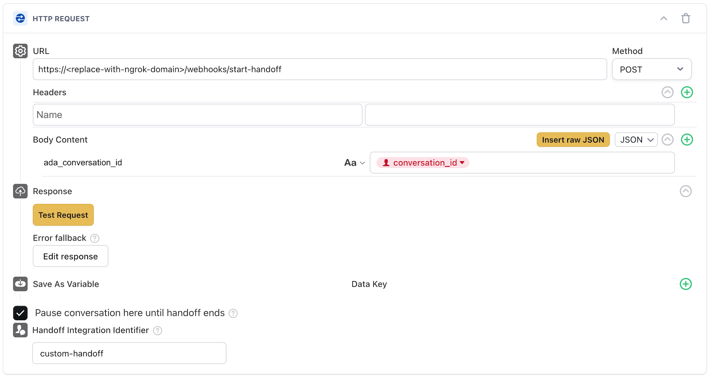

# Ada Handoffs API Demo

This is a demo project providing a minimal implementation of a custom handoff

## Prerequisites
- Python 3.12+ (`python3 --version` to check)
- A reverse proxy solution (this README setup uses [ngrok](https://ngrok.com), but any reverse proxy is fine)
- Access to Platform > APIs and Platform > Webhooks in your Ada AI Agent
```

## 1. Setting up this repo

First, you will need to setup your python environment. Ensure you have python 3.12 installed,
and then run the following commands:

```bash
python -m venv .venv
. .venv/bin/activate
pip install -e .
```

Then copy the contents of .env.example into a .env file

```bash
cp .env.example .env
```

The .env file will need the correct credentials; we will fill these in later on.

The last thing you will need to do is setup a reverse proxy to the service. Any reverse proxy is fine, but for
the sake of this guide we will use ngrok. You can add the following sample reverse proxy settings to your ngrok configuration:

```yaml
handoffs-api-demo:
    addr: localhost:8090
    proto: http
    hostname: <ngrok host domain url to reserve>
```

Then you can start this tunnel by running `ngrok start handoffs-api-demo`.

## 2. Configuring the handoff

Next we will need to configure the handoff in the AI Agent dashboard. First you will need to configure a handoff flow to use
the HTTP request block as the triggering point for the handoff. Configure the fields for the block as follows:



<details><summary>Alternatively you can copy and paste this blob into your handoffs flow</summary>

```json
[{"isLoading":false,"locked":false,"reviewableMessage":false,"variableId":null,"type":"http_request_recipe","headers":{"":""},"headersList":[{"key":"","value":""}],"errorResponse":true,"isHandoff":true,"shouldPause":true,"handoffIntegrationLabel":"sandbox-handoff","requestUrl":"https://<replace-with-ngrok-domain-url>/webhooks/start-handoff","requestPayload":[{"key":"ada_conversation_id","value":"replace with @conversation_id variable","type":"string"}],"requestPayloadType":"json","requestType":"POST","variablesData":[],"successBusinessEvent":{"value":"","eventKey":"","isVariable":false}}]
```

</details>

> [!IMPORTANT]
> Make sure to update the URL and `ada_conversation_id` body field as instructed.

## 3. Configuring API Keys and Webhooks

Next we will setup the remaining configuration to enable bidirectional communication between your AI Agent and the demo repo.
To start with, create a new Platform API Key by navigating to `Platform > APIs` and create a new API key. Copy this value
into your `.env` file you created from [step 1](#1-setting-up-this-repo); it should be set as the value for `ADA_API_KEY`.

Then you will need to configure a webhook in your AI Agent that will send events to this demo repo.

In your AI Agent dashboard, go to `Platform > Webhooks` and create a new endpoint. The URL should be `<ngrok-domain-url>/webhooks/events`
(e.g. `https://custom-handoff.ngrok.io/webhooks/events`), and you should subscribe to at minimum the `v1.conversation.message` and
`v1.conversation.handoff.ended` events. Once the webhook is created, click on the Endpoint to view it, and on the right hand side,
reveal the Signing Secret value. Copy this value into `WEBHOOK_SECRET` in your `.env` file from [step 1](#1-setting-up-this-repo).

Lastly, set `ADA_BASE_URL` in your `.env` file to point to your AI Agent's base URL with "/api" appended to it. This would take
the form `https://<ai-agent-handle>[.<region>].ada.support/api`.


## 4. Running the Custom Handoff

With everything configured, you can now run the demo repo. Ensure you have your reverse proxy running, and then run

```python
. .venv/bin/activate
python run.py
```

With the repo running, go to your AI Agent's chat, and trigger the handoff flow with your request block. If the handoff is
successful, the AI Agent should stop responding, and a conversation transcript should appear in the demo agent chat. Enter a message as an agent
in the chat window to connect + send the first agent message. You should be able to then chat back and forth and end the handoff just like
any other handoff integration.

> [!NOTE]
> This code is for example use only, and modifications may be needed to run this code. Additionally, pull requests and/or issues for this repository will not be monitored.
